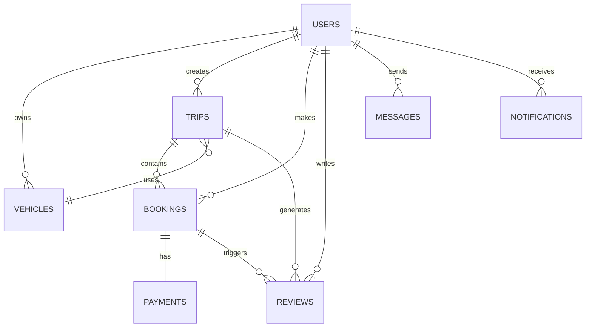

# 🚗 Projet Co-voiturage - Documentation Complète

## 📋 Vue d'ensemble

Ce projet est une **application de co-voiturage** développée avec **AdonisJS 6**, utilisant **TypeScript** et **PostgreSQL**. L'application permet aux utilisateurs de proposer et réserver des trajets en voiture partagée.

### 🎯 Objectifs du Projet

- Faciliter le partage de trajets entre particuliers
- Réduire les coûts de transport
- Diminuer l'impact environnemental des déplacements
- Créer une communauté d'utilisateurs fiables avec un système d'évaluation

---

## 🏗️ Architecture Technique

### Stack Technologique

| Composant                   | Technologie      | Version |
| --------------------------- | ---------------- | ------- |
| **Framework Backend**       | AdonisJS         | 6.18.0  |
| **Langage**                 | TypeScript       | ~5.8    |
| **Base de Données**         | PostgreSQL       | -       |
| **ORM**                     | Lucid (AdonisJS) | 21.6.1  |
| **Authentification**        | AdonisJS Auth    | 9.4.0   |
| **Validation**              | VineJS           | 3.0.1   |
| **Gestionnaire de Paquets** | PNPM             | -       |

### 📦 Dépendances Principales

#### Production

- `@adonisjs/core` : Framework principal
- `@adonisjs/auth` : Système d'authentification
- `@adonisjs/lucid` : ORM et migrations
- `@adonisjs/cors` : Gestion CORS
- `pg` : Driver PostgreSQL
- `uuid` : Génération d'identifiants uniques
- `luxon` : Gestion des dates
- `@vinejs/vine` : Validation des données

#### Développement

- `@adonisjs/assembler` : Builder de production
- `@japa/runner` : Framework de tests
- `eslint` : Linter JavaScript/TypeScript
- `prettier` : Formatage du code
- `pino-pretty` : Logger de développement

---

## 🗄️ Modèle de Données

### Structure de la Base de Données

Le système utilise **8 tables principales** avec des relations complexes :

#### 1. **Users** 👥

- **Table principale** gérant les utilisateurs (conducteurs et passagers)
- **Clé primaire** : UUID
- **Héritage** : Combine les rôles Driver et Passenger
- **Fonctionnalités** :
  - Profil utilisateur complet
  - Note globale calculée
  - Vérification d'identité
  - Historique des trajets

#### 2. **Vehicles** 🚗

- **Véhicules** appartenant aux conducteurs
- **Informations** : Marque, modèle, couleur, immatriculation
- **Caractéristiques** : Nombre de places, climatisation, carburant
- **Vérification** : Validation des documents

#### 3. **Trips** 🛣️

- **Trajets** proposés par les conducteurs
- **Itinéraire** : Ville de départ/arrivée, arrêts possibles
- **Tarification** : Prix par place, frais de service
- **Gestion** : Places disponibles, statuts multiples
- **Options** : Animaux, bagages autorisés

#### 4. **Bookings** 📋

- **Réservations** effectuées par les passagers
- **Suivi** : Statut de la réservation, nombre de places
- **Paiement** : Montant total, commentaires
- **Workflow** : Confirmation → Paiement → Voyage

#### 5. **Payments** 💳

- **Paiements** liés aux réservations
- **Méthodes** : Carte bancaire, portefeuille digital
- **Statuts** : En attente, confirmé, échoué, remboursé
- **Frais** : Commission de service calculée

#### 6. **Reviews** ⭐

- **Évaluations bidirectionnelles** (conducteur ↔ passager)
- **Notation** : Système d'étoiles (1-5)
- **Commentaires** : Feedback détaillé
- **Types** : Évaluation conducteur/passager

#### 7. **Messages** 💬

- **Messagerie interne** entre utilisateurs
- **Conversations** : Liées optionnellement aux trajets
- **Statuts** : Lu/non lu, horodatage
- **Notifications** : Alertes en temps réel

#### 8. **Notifications** 🔔

- **Système de notifications push**
- **Types** : Réservation, paiement, annulation, rappel
- **Gestion** : Marquer comme lu, historique
- **Personnalisation** : Préférences utilisateur

### 🔗 Relations Entre Tables



---

## 🚀 Fonctionnalités Implémentées

### 🔐 Système d'Authentification

- **Inscription/Connexion** sécurisée
- **Tokens d'accès** avec AdonisJS Auth
- **Vérification d'identité** pour les conducteurs
- **Sessions persistantes**

### 👤 Gestion des Profils

- **Profils complets** avec photo
- **Vérification** des pièces d'identité
- **Historique** des trajets et évaluations
- **Note globale** calculée automatiquement

### 🚗 Gestion des Véhicules

- **Ajout multiple** de véhicules par conducteur
- **Validation** des documents (carte grise, assurance)
- **Photos** et descriptions détaillées
- **Caractéristiques** techniques complètes

### 🛣️ Système de Trajets

- **Publication** de trajets avec itinéraires détaillés
- **Recherche avancée** par ville, date, prix
- **Gestion des places** en temps réel
- **Arrêts intermédiaires** configurables
- **Statuts multiples** : Brouillon → Publié → Complet → Terminé

### 📱 Réservations et Paiements

- **Réservation instantanée** ou avec validation
- **Paiement sécurisé** intégré
- **Calcul automatique** des frais de service
- **Gestion des remboursements**
- **Historique complet** des transactions

### ⭐ Système d'Évaluations

- **Évaluations bidirectionnelles** obligatoires
- **Système d'étoiles** (1-5) avec commentaires
- **Calcul automatique** de la note globale
- **Modération** des avis inappropriés

### 💬 Messagerie et Communication

- **Chat intégré** entre utilisateurs
- **Notifications push** en temps réel
- **Historique** des conversations
- **Liens avec les trajets** pour contexte

---

## 📁 Structure du Projet

```
co-voiturage/
├── app/
│   ├── models/           # Modèles Lucid (User, Trip, etc.)
│   ├── controllers/      # Contrôleurs API
│   ├── middleware/       # Middlewares personnalisés
│   ├── validators/       # Validateurs VineJS
│   ├── services/         # Services métier
│   └── exceptions/       # Exceptions personnalisées
├── database/
│   ├── migrations/       # Migrations de base de données
│   └── seeders/          # Données de test
├── config/
│   ├── database.ts       # Configuration DB
│   ├── auth.ts          # Configuration authentification
│   ├── cors.ts          # Configuration CORS
│   └── app.ts           # Configuration application
├── start/
│   ├── routes.ts        # Définition des routes
│   ├── kernel.ts        # Middlewares globaux
│   └── env.ts           # Variables d'environnement
├── tests/
│   ├── unit/            # Tests unitaires
│   └── functional/      # Tests d'intégration
└── bin/
    └── server.js        # Point d'entrée production
```

---

## 🔧 Configuration et Installation

### Prérequis

- **Node.js** >= 18.0.0
- **PostgreSQL** >= 13
- **PNPM** ou NPM

### Installation

```bash
# Cloner le projet
git clone [url-du-repo]
cd co-voiturage

# Installer les dépendances
pnpm install

# Configurer l'environnement
cp .env.example .env
# Éditer .env avec vos paramètres DB

# Exécuter les migrations
node ace migration:run

# Démarrer en développement
pnpm dev
```

### Scripts Disponibles

| Script            | Commande      | Description             |
| ----------------- | ------------- | ----------------------- |
| **Développement** | `pnpm dev`    | Serveur avec hot-reload |
| **Production**    | `pnpm start`  | Serveur de production   |
| **Build**         | `pnpm build`  | Compilation TypeScript  |
| **Tests**         | `pnpm test`   | Exécution des tests     |
| **Linting**       | `pnpm lint`   | Vérification du code    |
| **Format**        | `pnpm format` | Formatage automatique   |

---

## 🛠️ Outils de Développement

### Qualité du Code

- **ESLint** : Analyse statique du code
- **Prettier** : Formatage automatique
- **TypeScript** : Typage statique
- **Hot Reload** : Rechargement automatique en développement

### Tests

- **Japa** : Framework de tests pour AdonisJS
- **Tests unitaires** : Modèles et services
- **Tests fonctionnels** : API et intégrations
- **API Client** : Tests des endpoints

### Base de Données

- **Migrations** : Versioning de la structure DB
- **Seeders** : Données de test reproductibles
- **Rollback** : Retour en arrière possible
- **Index optimisés** : Performance des requêtes

---

## 🔒 Sécurité

### Authentification et Autorisation

- **Tokens JWT** sécurisés
- **Hash des mots de passe** avec Argon2
- **UUID non-prédictibles** pour tous les IDs
- **Middleware d'authentification** sur les routes protégées

### Validation des Données

- **VineJS** pour validation côté serveur
- **Contraintes DB** avec clés étrangères
- **Énumérations** pour les statuts
- **Validation des types** TypeScript

### Protection CORS

- **Configuration CORS** appropriée
- **Headers de sécurité** configurés
- **Rate limiting** (à implémenter)
- **HTTPS** en production

---

## 📊 Diagrammes d'Architecture

### Diagramme de Classes UML

Le projet suit le diagramme défini dans `covoid2.mermaid` :

- **8 classes principales** avec relations
- **Héritage** : User → Driver/Passenger
- **Agrégation** : Driver ◇—— Vehicle
- **Composition** : Trip ♦—— Booking
- **Associations** avec cardinalités respectées

### Architecture en Couches

```
┌─────────────────────────────────┐
│          API Routes             │  ← Routes HTTP
├─────────────────────────────────┤
│         Controllers             │  ← Logique de contrôle
├─────────────────────────────────┤
│          Services               │  ← Logique métier
├─────────────────────────────────┤
│          Models                 │  ← Modèles de données
├─────────────────────────────────┤
│         Database                │  ← PostgreSQL
└─────────────────────────────────┘
```

---

## 🚀 Évolutions Futures

### Fonctionnalités Planifiées

- [ ] **API REST complète** avec tous les endpoints
- [ ] **Interface utilisateur** (web/mobile)
- [ ] **Géolocalisation** en temps réel
- [ ] **Notifications push** mobiles
- [ ] **Paiements** avec Stripe/PayPal
- [ ] **Chat en temps réel** avec WebSockets
- [ ] **Système de filtres** avancés
- [ ] **Recommandations** basées sur l'historique

### Améliorations Techniques

- [ ] **Cache Redis** pour les performances
- [ ] **CDN** pour les images
- [ ] **Monitoring** avec logs structurés
- [ ] **CI/CD** avec GitHub Actions
- [ ] **Documentation API** avec Swagger
- [ ] **Tests E2E** automatisés
- [ ] **Docker** pour le déploiement
- [ ] **Métriques** et analytics

---

## 👥 Équipe et Contribution

### Standards de Code

- **Convention de nommage** : camelCase pour JS/TS, snake_case pour DB
- **Commits** : Messages conventionnels (feat, fix, docs, etc.)
- **Branches** : GitFlow (main, develop, feature/_, hotfix/_)
- **Code Review** : Obligatoire avant merge

### Documentation

- **README** : Instructions d'installation et utilisation
- **MIGRATION_SUMMARY** : Historique des changements DB
- **API Docs** : Documentation des endpoints (à venir)
- **Diagrammes** : Architecture et flux de données

---

## 📞 Support et Contact

### Ressources

- **Documentation AdonisJS** : [docs.adonisjs.com](https://docs.adonisjs.com)
- **Guide PostgreSQL** : Configuration et optimisation
- **Best Practices** : Patterns et conventions TypeScript

### Maintenance

- **Mises à jour** : Dépendances et sécurité
- **Backups** : Sauvegarde régulière de la DB
- **Monitoring** : Surveillance des performances
- **Support** : Résolution des bugs et évolutions

---

_Dernière mise à jour : Janvier 2025_
